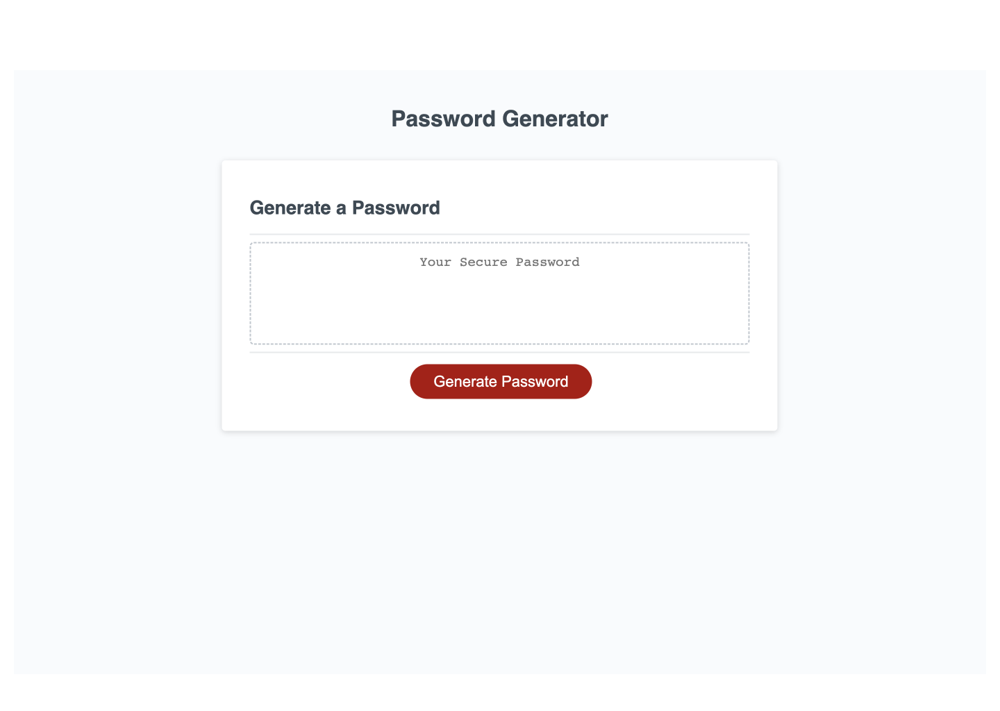

# safe-password-creator

## Description
This repository contains the Module 03 Challenge. This project aims to create a user-friendly tool for generating strong and secure random passwords. Users can customize the password length and select the types of characters to include, such as lowercase letters, uppercase letters, numbers, and special characters. By providing these options, the tool ensures the creation of unique and robust passwords.

## Instalation
N/A

## Usage
You can visit the live website by clicking on the following link:
 https://carlos-2mm.github.io/safe-password-creator/

A preview of the website:

## Credits

https://github.com/coding-boot-camp/friendly-parakeet
  This is the website to the original repository.

https://www.codecademy.com/resources/docs/javascript
This page covered fundamental programming principles and concepts in JavaScript.

https://www.w3schools.com/js/js_htmldom_eventlistener.asp
This page offers insights into how to efficiently handle user interactions in web applications.

https://developer.mozilla.org/en-US/docs/Web/JavaScript/Reference/Global_Objects/String
The JavaScript String Documentation provided comprehensive guidance on working with textual data.

https://developer.mozilla.org/en-US/docs/Web/API/Window/confirm
By implementing the "Alerts User to Select Character Preferences" feature in my password generator project.

https://developer.mozilla.org/en-US/docs/Web/JavaScript/Reference/Global_Objects
Understanding the built-in objects in JavaScript allowed me to create and manage complex data structures.

## License

Please refer to the LICENSE in repo